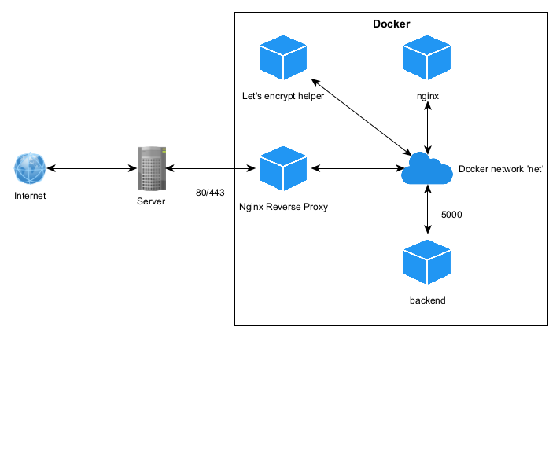

# Wiener Linien Störungsarchiv - Dokumentation

Verfasser: **Leo Mühlböck**

Datum: **30.12.2022**

## Einführung

Die Störungen der Wiener Linien sind ein praktischer Bestandteil der Wiener Linien Open-Data Schnittstelle. Es werden live Daten zu Ausfällen, Verspätungen, Unfällen usw. zur Verfügung gestellt. Jedoch bleiben die Daten nur so lange bestehen, bis die jeweilige Störung behoben ist. Eine nützliche Funktion wäre, die Daten auch nachher noch einsehen zu können.

## Projektbeschreibung

Das Wiener Linien Störungsarchiv ist eine Applikation, welche die Störungen aus der Wiener Linien API ausliest, aufzeichnet und auf einer Website darstellt.

Das Backend besteht aus zwei Teilen: 

- Ein Python-Skript, das in periodischem Zeitabstand die Störungen aus der Wiener Linien API fetched, mit Daten in einer SQLite-Datenbank abgleicht und gegebenenfalls aktualisiert.
- Eine Rest-API mit dem Python-Package Flask, das die Daten aus der Datenbank öffentlich zur Verfügung stellt.

Das Frontend ist eine VueJS-Website, welche die Daten aus der Rest-API ausliest und übersichtlich darstellt.

## Das Backend

### Datenbankstruktur

Die SQLite3-Datenbank hat folgenden Aufbau:


- Tabelle `disturbances`: Hier sind alle Störungen gespeichert

  - `id` wird aus der API übernommen, um die Störungen bei Aktualisierung mit dem Wiener Linien Server wieder eindeutig identifizieren zu können
  - `title` ist der Titel der Störung
  - `type` ist der Typ der Störung
    - 0 für Verspätungen
    - 1 für Verkehrsunfall
    - 2 für schadhaftes Fahrzeug
    - 3 für Gleisschaden
    - 4 für Weichenstörung
    - 5 für Fahrleitungsgebrechen
    - 6 für Signalstörung
    - 7 für Rettungseinsatz
    - 8 für Polizeieinsatz
    - 9 für Feuerwehreinsatz
    - 10 für Falschparker
    - 11 für Demonstration
    - 12 für Veranstaltung
    - 13 für Sonstige
  - `start_time` ist der Zeitpunkt, an dem die Störung begonnen hat
  - `end_time` ist der Zeitpunkt, an dem die Störung komplett behoben ist - ist NULL wenn die Störung noch aktuell ist und wird erst ausgefüllt, sobald die Störung am Wiener Linien Server gelöscht ist
- Tabelle `disturbance_descriptions`: Hier sind alle Beschreibungen einer Störungen gespeichert. Da sich die Beschreibung einer Störung im Laufe der Zeit ändert, werden manchmal mehrere Beschreibungen zu einer Störung gespeichert (z. B. von kein Betrieb zu Verspätungen)

  - `disturbance_id` ist die `id` der zugehörigen Störung
  - `description` ist die Beschreibung
  - `time` ist der Zeitpunkt, an dem die Beschreibung aktuell gültig war
- Tabelle `lines`: Hier werden alle (jemals) betroffenen Linien gespeichert

  - `id` ist die eindeutige Identifikation für die Linie (z.B. 31, 32A, U6, ...)
  - `type` ist der Typ der Linie
    - 0 für Bus
    - 1 für Straßenbahn
    - 2 für U-Bahn
- Tabelle `disturbances_lines`: Hier werden die Linien zu den Störungen gespeichert (um many-many Beziehung zu ermöglichen)

  - `disturbances_id` ist die `id` der Störung
  - `line_id` ist die `id` der Linie

Die Datenbank wird über das Create-Script `backend/schema.sql` erstellt.

### Störungsaufzeichnung

Für die Aufzeichnung der Störungen ist das Python-Skript `backend/update_db.py` zuständig. Es wird auf einem Server in periodischen Zeitabständen ausgeführt (2-5 Minuten - je größer desto mehr leidet die Genauigkeit von `end_time`). Eine Möglichkeit die periodische Ausführung umzusetzen ist weiter unten angeführt.

Die Funktionsweise ist simpel: Es werden die aktuellen Störungen aus der Wiener Linien API geholt und mit der lokalen Datenbank abgeglichen. Dabei gibt es drei Fälle:

1. Eine Störung ist neu (also noch nicht in der Datenbank): Sie wird mit den wichtigsten Daten in `disturbances` gespeichert, die zugehörige Beschreibung in `disturbance_descriptions` und die betroffenen Linien in `disturbances_lines` (wenn es eine noch nicht bekannte Linie ist auch in `lines`)
2. Eine Störung ist aktuell (bereits in der Datenbank): Die Beschreibung der Störung wird mit der aktuellsten in der Datenbank abgeglichen. Wenn diese nicht gleich sind, wird die aktuelle Beschreibung als neuer Eintrag in `disturbance_descriptions` gespeichert. 
3. Eine Störung ist vorbei (in der Datenbank aber nicht mehr in der API): Die `end_time` der betroffenen Störung wird gesetzt.

#### Periodische Ausführung mit cron

Auf Linux-Systemen eine periodische Ausführung mittels cron-Tabs realisiert werden. Meistens ist cron schon installiert - doch zur Sicherheit, hier der Installationsbefehl:

```bash
sudo apt install cron
```

Um einen cron-Tab einzurichten, muss die cron-Datei bearbeitet werden. Diese kann entweder direkt mit einem Texteditor geöffnet werden (hier nano) und danach die Zeile angefügt werden:

```bash
sudo nano /etc/crontab
```

```
*/2 * * * * cd /pfad/zum/backend && python3 /pfad/zu/update_db.py
```

Oder es wird in einem Schritt mittels dem echo-Befehl und dem Umleitungsoperator gemacht (so auch im Dockerfile realisierbar):

```bash
echo "*/2 * * * * cd /pfad/zum/backend && python3 /pfad/zu/update_db.py" >> /etc/crontab
```

Es sind natürlich alle Pfade entsprechend anzupassen. Die erste Zahl in der cron-Zeile (hier 2) gibt den Zeitabstand zwischen den Ausführungen in Minuten an.

### API

Damit das Frontend auf die Daten in der Datenbank zugreifen kann, ist die REST-API `api.py` notwendig. Sie wurde mittels dem Python-Package Flask umgesetzt. Die Dokumentation der API-Endpunkte ist in der README zu finden.

Die API wird mit Guinicorn, einem produktionsfähigem Web-Server-Gateway, und Nginx als Reverse-Proxy bereitgestellt. Gunicorn wird über das [PyPI-Package](https://pypi.org/project/gunicorn/) installiert und verwendet. Die Nginx-Konfiguration befindet sich bei `nginx/nginx.conf` und konfiguriert die Überbrückung vom Internet zum lokalen Gunicorn-Server, der über die lokale Domain `http://backend:5000` erreichbar sein muss (mit Docker Compose über `expose`-Ports möglich).

## Das Frontend

Das Frontend ist eine Website, die mit dem JavaScript-Framework [VueJS](https://vuejs.org/) umgesetzt ist. VueJS wurde vor allem wegen der Einfachheit und der implementierten Router-Funktion (Seiten anzeigen ohne neu laden) gewählt. Zusätzlich wird noch die Component-Library [Quasar](https://quasar.dev/) verwendet, um mit vorgefertigten UI-Elementen arbeiten zu können.

Um das Frontend zu builden, müssen folgende Befehle ausgeführt werden ([NodeJS](https://nodejs.org/en/) vorausgesetzt):

```bash
npm install
```

```bash
npm run build
```

Im Ordner `dist` befinden sich dann die produktionsfertigen Dateien.

## Deployment mit Docker

Um die Störungsaufzeichnung zu realisieren und die API sowie das Frontend bereitzustellen, wird ein bereits vorhandener Server verwendet. Dieser wurde auf [DeinServerHost](https://deinserverhost.de/) gemietet.  Das Betriebssystem ist Ubuntu20-64bit und es wurde bereits Docker und Docker Compose nach offiziellem Tutorial installiert. [1]

#### Struktur



- **Nginx Reverse Proxy & Let's encrypt helper:** Der Reverse Proxy Container sorgt dafür, dass Anfragen von außen an die jeweiligen Nginx-Server Container weitergeleitet werden bzw. Responses nach außen geleitet werden. In diesem Fall verbindet er also den Container nginx mit dem Internet. Der Let's encrypt helper Container sorgt dafür, dass immer ein aktuelles SSL-Zertifikat für die Nginx-Container vorliegt, sodass die HTTPS-Website ohne Sicherheitswarnung aufgerufen werden kann.

  Diese Container sind nicht im Compose-File enthalten und müssen selbstständig konfiguriert werden. [2]

- **backend (`backend/Dockerfile`)**: Dieser Container übernimmt die Störungsaufzeichnung und die API. Das Python-Skript `update_db.py` wird mittels cron alle 2 Minuten im Container ausgeführt. Die API wird über Gunicorn ausgeführt und über den Port 5000 in das Docker-Netzwerk weitergeleitet. Die Datenbank `data.db` wird als Volume definiert, sodass sie am Server selbst gespeichert wird und nach Verwerfen des Containers noch vorhanden bleibt.

- **nginx (`nginx/Dockerfile`)**: Dieser Container übernimmt die Bereitstellung ins Web mit Nginx. Das Frontend wird bei jedem Start des Containers gebuildet und über Nginx zugänglich gemacht. Die API wird über den Guicorn-Port am Pfad `/api` zugänglich gemacht.

- **Docker-Netzwerk `net`**: Das Docker-Netzwerk, über das alle Container kommunizieren. Es muss vor dem Start der Container erstellt werden:

  ```bash
  sudo docker network create net
  ```

### Deploy

```bash
sudo docker compose up -d
```

## Quellen

[1] *Install Docker engine on ubuntu* (2022) *Docker Documentation*. Available at: https://docs.docker.com/engine/install/ubuntu/#install-using-the-repository (Accessed: November 29, 2022). 

[2] *How to use Nginx Reverse Proxy with multiple Docker apps*, *Linux Handbook*. Linux Handbook. Available at: https://linuxhandbook.com/nginx-reverse-proxy-docker/ (Accessed: December 30, 2022). 


*Wiener Linien realtime | Schnittstellendokumentation*. Available at: https://www.wienerlinien.at/ogd_realtime/doku/ogd/wienerlinien-echtzeitdaten-dokumentation.pdf (Accessed: October 24, 2022). 

*SQLite cheat sheet* (2020) *SQLite Tutorial*. Available at: https://www.sqlitetutorial.net/sqlite-cheat-sheet/ (Accessed: October 27, 2022). 

*Using SQLite 3 with Flask - Flask Documentation (2.2)*. Available at: https://flask.palletsprojects.com/en/2.2.x/patterns/sqlite3/ (Accessed: October 27, 2022). 

*Dockerizing flask with postgres, gunicorn, and Nginx*, *testdriven.io*. Available at: https://testdriven.io/blog/dockerizing-flask-with-postgres-gunicorn-and-nginx/#docker (Accessed: December 30, 2022).

https://stackoverflow.com/
